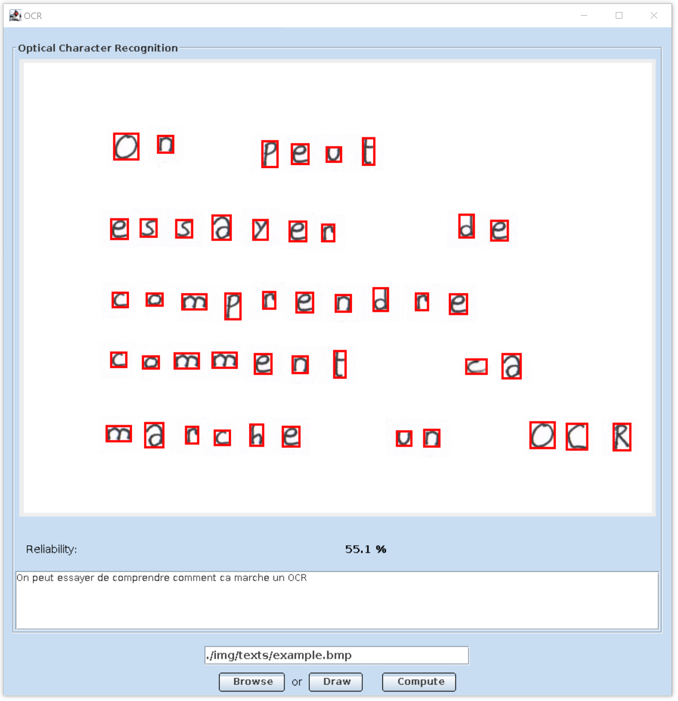

# Optical Character Recognizer

Optical Character Recognizer is a Java executable (Jar). It converts handwritten characters into machine-encoded characters using a multilayer artificial neural network system.



## Requirements

Building the Sudoku Solver executable requires the following tools:
- X.org graphic system (see [www.x.org](https://www.x.org/wiki/))
```bash
sudo apt-get install xorg
```
- OpenJDK (see [openjdk.java.net](https://openjdk.java.net))
```bash
sudo apt-get install openjdk-8-jre
```
- Fast Artificial Neural Network library (see [FANN website](http://leenissen.dk/fann/wp/))
```bash
sudo apt-get install libfann-dev
```

## Compilation

To build the executable, use:
```bash
make all
```

## Usage

To launch the Java executable, use:
```bash
make run
```
Then, browse, select an BMP image and click on the "Start" button. Some BMP example are availbale in:
- [`img/letters/`](img/letters/)
- [`img/letters_small/`](img/letters_small/)
- [`img/numbers/`](img/numbers/)
- [`img/symbols/`](img/symbols/)
- [`img/text/`](img/texts/)

The vertical space sensibility is defined by the `MATRIX_SPACE_SENSI_Y` constant (see .[`ICharactersConstants.java`](src/bmp/ICharactersConstants.java)).

The horizontal space sensibility is defined by the `MIN_SPACE_CHARS` constant (see .[`INeuralNetworkConstants.java`](src/fann/INeuralNetworkConstants.java)).

 

## License

Distributed under the [Apache License, Version 2.0](http://www.apache.org/licenses/). See [`LICENSE`](LICENSE) for more information.
